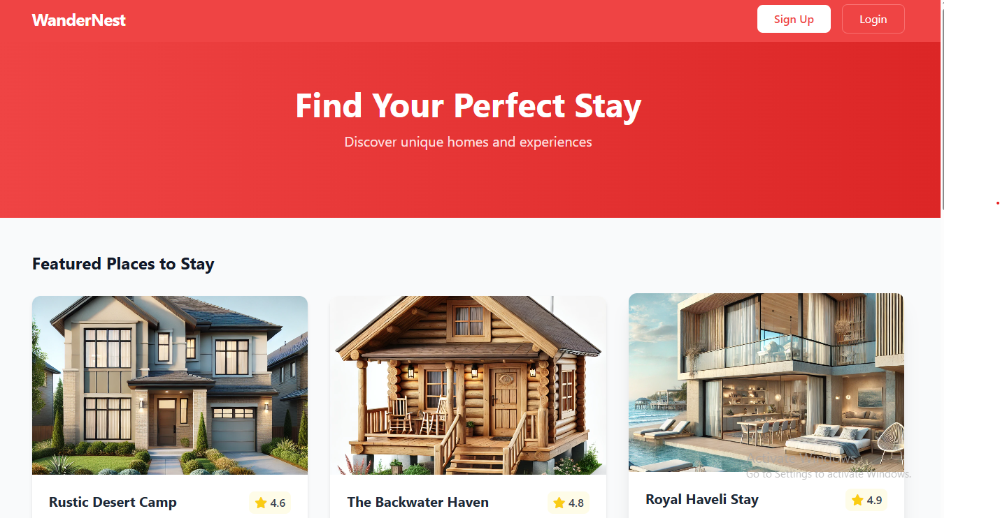
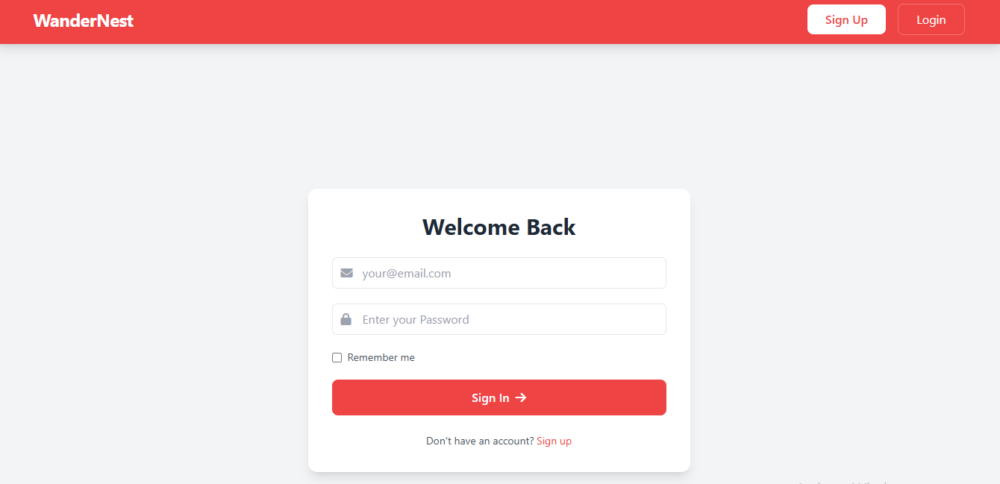
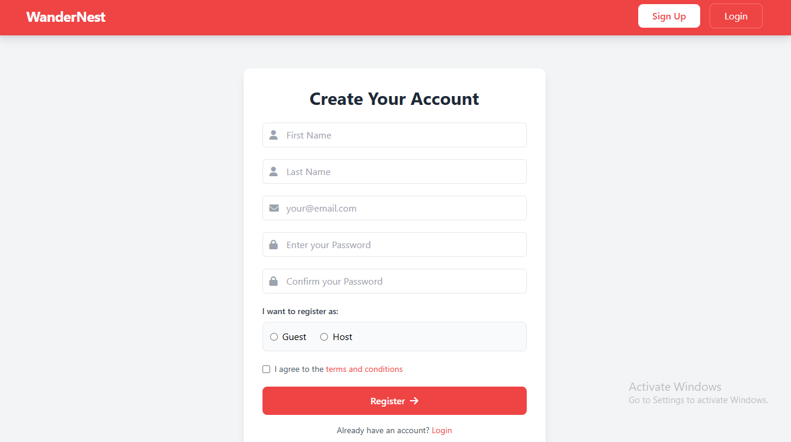
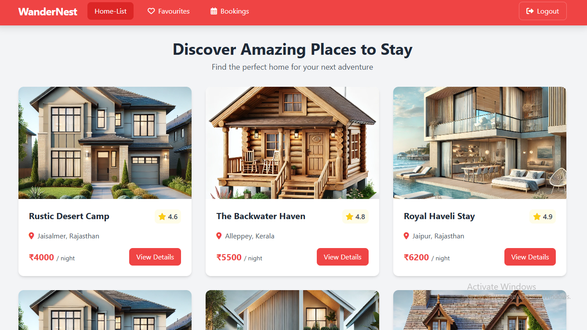
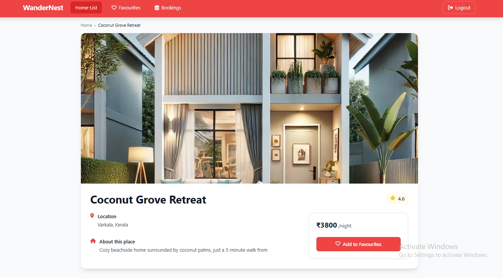
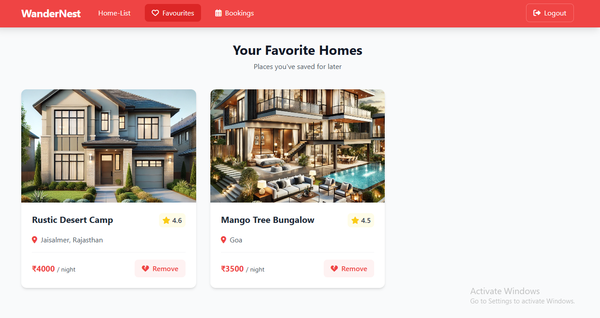
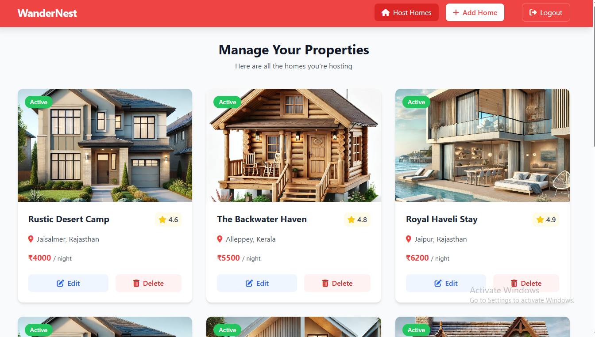
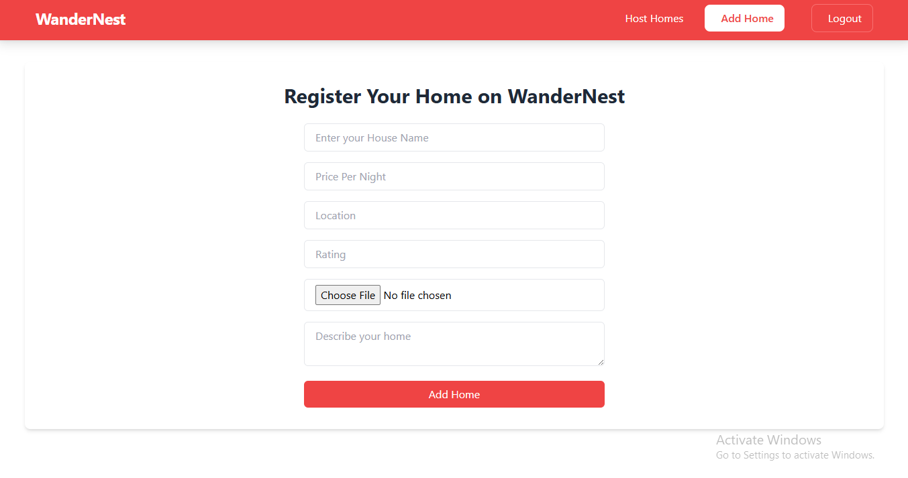

<div align="center">


# 🏠 WanderNest

### A full-stack house rental platform that allows users to discover, save, and manage rental properties with role-based access for Guests and Hosts.

[](https://github.com/reshabweb/WanderNest/stargazers)
[](https://github.com/reshabweb/WanderNest/network/members)
[](https://github.com/reshabweb/WanderNest/issues)
[](https://github.com/reshabweb/WanderNest/blob/main/LICENSE)

</div>

---

# 📖 Overview

WanderNest is a full-stack house rental platform inspired by modern vacation rental applications. The platform allows users to browse rental properties, view detailed information, save favorite homes, and manage listings.

The application supports role-based user registration where users can join as Guests or Hosts. Hosts can add, edit, and delete property listings, while Guests can browse properties and save them to their favorites.

Built using Node.js, Express.js, MongoDB, EJS, and Tailwind CSS, WanderNest demonstrates full-stack development concepts including authentication, session management, file uploads, database integration, and MVC architecture.

---

# 🎯 Project Goals

- Build a real-world full-stack web application
- Implement authentication and session management
- Enable role-based access control (Guest & Host)
- Manage rental property listings
- Allow users to save favorite properties
- Demonstrate MVC architecture implementation
- Integrate MongoDB with Mongoose
- Handle image uploads using Multer
- Create a responsive and user-friendly interface

---

# ✨ Features

## 🔐 Authentication & Authorization

- User Registration
- User Login
- User Logout
- Password Hashing using bcryptjs
- Session-Based Authentication
- Role-Based User Registration
- Protected Routes

## 🏠 Property Management

- Add New Property
- Edit Property Details
- Delete Property
- View Property Details
- Upload Property Images
- Manage Hosted Properties

## ❤️ Favorites System

- Save Properties to Favorites
- Remove Properties from Favorites
- View Favorite Properties

## 👨‍💼 Host Dashboard

- View Hosted Properties
- Manage Listings
- Edit Existing Properties
- Delete Existing Properties

## 🎨 Frontend Features

- Responsive Design
- Dynamic EJS Templates
- Tailwind CSS Styling
- Interactive User Interface
- Property Cards & Detail Views

## ⚡ Backend Features

- MVC Architecture
- Express.js Routing
- MongoDB Database Integration
- Session Management
- File Upload Handling
- Modular Code Structure

---

# 🚀 Tech Stack

<p align="left">
  
</p>


---

# 🏗️ Architecture

```text
Client Browser
      │
      ▼
Express Server
      │
      ├── Routes
      ├── Controllers
      ├── Middleware
      ├── Session Authentication
      └── MongoDB Database
```

## Request Flow

1. User sends request.
2. Express routes receive request.
3. Middleware validates session.
4. Controllers execute business logic.
5. Mongoose interacts with MongoDB.
6. EJS renders dynamic views.
7. Response is returned to the user.

---

# 📸 Screenshots

## 🏠 Home Page



---

## 🔑 Login Page



---

## 📝 Signup Page



---

## 🏘️ Property Listing



---

## 📄 Property Details



---

## ❤️ Favorites



---

## 👨‍💼 Host Dashboard



---

## ➕ Add Property



---

# 📂 Project Structure

```text
WanderNest
│
├── controllers/
│
├── models/
│
├── routes/
│
├── middleware/
│
├── public/
│   ├── css/
│   ├── images/
│   └── uploads/
│
├── views/
│   ├── auth/
│   ├── host/
│   ├── store/
│   └── shared/
│
├── screenshots/
│
├── .env.example
├── package.json
└── app.js
```

---

# ⚙️ Installation

```bash
# Clone repository
git clone https://github.com/reshabweb/WanderNest.git

# Navigate into project
cd WanderNest

# Install dependencies
npm install
```

---

# 🔑 Environment Variables

Create a `.env` file in the root directory:

```env
PORT=3000

MONGO_URI=

SESSION_SECRET=
```

---

# 🚀 Usage

### Start Development Server

```bash
npm start
```

Server runs on:

```text
http://localhost:3000
```

---

# 📋 Main Routes

## Authentication

| Method | Route | Description |
|----------|----------|-------------|
| GET | `/login` | Login Page |
| POST | `/login` | User Login |
| GET | `/signup` | Signup Page |
| POST | `/signup` | Register User |
| POST | `/logout` | Logout User |

---

## Properties

| Method | Route | Description |
|----------|----------|-------------|
| GET | `/` | Home Page |
| GET | `/homes` | View All Properties |
| GET | `/homes/:id` | View Property Details |

---

## Host Management

| Method | Route | Description |
|----------|----------|-------------|
| GET | `/host/add-home` | Add Property Page |
| POST | `/host/add-home` | Create Property |
| GET | `/host/edit-home/:id` | Edit Property Page |
| POST | `/host/edit-home/:id` | Update Property |
| POST | `/host/delete-home/:id` | Delete Property |

---

## Favorites

| Method | Route | Description |
|----------|----------|-------------|
| GET | `/favourites` | View Favorites |
| POST | `/favourites/add/:id` | Add to Favorites |
| POST | `/favourites/remove/:id` | Remove from Favorites |

---

# 🎯 What I Learned

- Full-Stack Web Development
- MVC Architecture
- MongoDB & Mongoose
- Authentication & Authorization
- Session Management
- File Upload Handling with Multer
- Password Hashing using bcryptjs
- EJS Templating
- Role-Based Access Control
- Building Real-World Rental Platforms

---

# 🚀 Future Improvements

- Property Booking System
- Payment Gateway Integration
- Property Reviews & Ratings
- Google OAuth Authentication
- Email Notifications
- Property Search & Filtering
- Advanced Host Analytics
- Responsive Mobile Optimization
- Docker Deployment
- CI/CD Pipeline

---

# 🤝 Contributing

Contributions are welcome!

1. Fork the repository
2. Create a feature branch
3. Commit your changes
4. Push to your branch
5. Open a Pull Request

---

# 👨‍💻 Developer

**Reshab**

- Designed and developed the complete application
- Implemented authentication & session management
- Built property management system
- Integrated MongoDB and Mongoose
- Developed Favorites functionality
- Created Host Dashboard and Property CRUD features

---

# 📄 License

This project is licensed under the MIT License.

---

<div align="center">

⭐ Star this repository if you like it!

Made with ❤️ by [reshabweb](https://github.com/reshabweb)

</div>